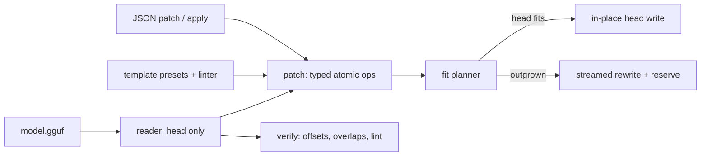

# gguf-chisel

[English](README.md) | [中文](README.zh.md) | [日本語](README.ja.md)

[](LICENSE) [](Cargo.toml)  [](CONTRIBUTING.md)

**オープンソースの GGUF メタデータ外科手術エディタ——キーのパッチ、チャットテンプレートの修正、ヘッドルームの確保をすべてインプレースで行い、テンソルデータは一切書き換えない。**


```bash
git clone https://github.com/JaydenCJ/gguf-chisel.git && cargo install --path gguf-chisel
```

> プレリリース版：crates.io には未公開。上記ワンライナーで依存ゼロの単一静的バイナリがビルドされます。

## なぜ gguf-chisel か？

誤った `tokenizer.chat_template` やコンテキスト長キーは、公開済み GGUF 量子化モデルで最もよくある欠陥であり、同時に最小の修正でもあります。しかし現在の標準的な直し方は llama.cpp の gguf-py スクリプト——numpy 込みの Python 環境が必要で、「既存スカラーの上書き」を超えることをすれば `gguf_new_metadata.py` がファイル*全体*をコピーします。大型量子化モデルなら 40 GB を丸ごと、ヘッド内の数百バイトを変えるためだけに。gguf-chisel はこれらのスクリプトが見過ごしているレイアウト上の事実を突きます：GGUF のテンソルオフセットはデータセクション起点の相対値なので、編集後のヘッドが元のデータオフセットちょうどで終わりさえすれば、テンソルバイトは 1 バイトも動きません。管理下のパディングキーでヘッドをバイト単位ぴったりにそこへ着地させ、本当に収まらないときは正直に拒否し、その場合でも末尾をそのままストリームコピーするだけ——テンソルの再エンコードは決して行いません。

|  | gguf-chisel | gguf_set_metadata.py | gguf_new_metadata.py |
|---|---|---|---|
| 実行環境 | 単一静的バイナリ、依存ゼロ | Python + gguf-py + numpy | Python + gguf-py + numpy |
| 既存スカラーの変更 | インプレース、ヘッドのみ書込 | インプレース | ファイル全体を再書込 |
| キーの追加・削除・改名 | ヘッドルームの範囲でインプレース | 不可 | ファイル全体を再書込 |
| チャットテンプレート修正 | インプレース、または 1 回のストリーム再書込¹ | 不可 | ファイル全体を再書込 |
| テンプレート lint + プリセット | あり（`template check`、6 プリセット） | なし | なし |
| 将来の編集用ヘッドルーム確保 | あり（`--reserve`） | なし | なし |
| 構造検証 | あり（`verify`） | なし | なし |
| スクリプト可能な適合判定 | あり（`--dry-run`、終了コード 0/3） | なし | なし |

<sub>¹ 新しいヘッドが既存スペースに収まる限りインプレース（縮小やパディング可能な編集は常に可）。超過時は 1 回だけ `--rewrite` が必要で、テンソルバイトはそのままストリームされる——一度 `--reserve` を付ければ以後の編集はインプレースのまま。依存数は 2026-07-13 に llama.cpp の gguf-py と照合。</sub>

## 機能

- **構造からしてインプレース** —— フィットプランナーが編集後のヘッドを元のデータオフセットちょうどに着地させる。アライメントの遊びと、バイト単位で長さ調整される管理下パディングキーの併用により、テンソル領域は書込モードで開かれることすらない。
- **ヘッドルームは自分で制御** —— 再書込時に `--reserve 4K` で予備パディングを確保すれば、以後の `set`/`rm`/`template set` はすべて純粋なヘッド書込。`show` は任意ファイルの残りヘッドルームを報告する。
- **チャットテンプレートを一級市民として** —— `template show/set/check/presets` にコミュニティ標準の 6 プリセットと Jinja サブセット linter を同梱。デリミタ不均衡、ブロック不一致、`messages` ループ欠落を書込*前*に検出する。
- **型付きのアトミック編集** —— `KEY=VALUE` はキーの既存ワイヤ型を維持し、`KEY=u32:32768` で型を強制。範囲違反は境界値つきで報告され、複数キー操作は全適用か全不適用のどちらか。
- **端から端までスクリプト可能** —— `dump` は整数を正確に保つ JSON を出力、`apply` はファイルまたは stdin から delete/rename/set パッチ文書を実行、`--dry-run` は「収まるか？」を終了コードで返す（0 = 収まる、3 = 再書込が必要）。
- **公開者向けの検証器** —— `verify` は内蔵の ggml 型サイズ表に基づき、重複キー、アライメント、テンソルオフセット、範囲、重なりを検査し、埋め込みテンプレートも lint する。
- **依存ゼロ・完全オフライン** —— GGUF コーデック、JSON コーデック、linter はすべて std のみの Rust。ネットワークには一切触れない。

## クイックスタート

インストール（Rust 1.75+ が必要）：

```bash
git clone https://github.com/JaydenCJ/gguf-chisel.git && cargo install --path gguf-chisel
```

コンテキスト長をインプレースで修正——実モデルでは数 KiB のヘッドだけを書き、残り約 40 GB はそのまま：

```bash
gguf-chisel set model.gguf sample.context_length=32768
```

出力（`gguf-chisel sample model.gguf` に対する実際のキャプチャ）：

```text
set sample.context_length: u32 4096 -> u32 32768
patched model.gguf in place: 704 head bytes written, tensor data untouched
```

より長いチャットテンプレートの導入：gguf-chisel は推測せず、1 回のストリーム再書込を求める。`--reserve` を付ければ、それがこのファイル最後の再書込になる：

```text
$ gguf-chisel template set model.gguf --preset llama3
set tokenizer.chat_template: string "{{ '<|im_st…" (201 bytes) -> string "{{ bos_token }}{% for message in message…" (261 bytes)
gguf-chisel: metadata head grew beyond the available space (need 752 bytes, have 704); re-run with --rewrite (optionally -o NEW.gguf), and consider --reserve to leave headroom for future in-place edits

$ gguf-chisel template set model.gguf --preset llama3 --rewrite --reserve 4K
set tokenizer.chat_template: string "{{ '<|im_st…" (201 bytes) -> string "{{ bos_token }}{% for message in message…" (261 bytes)
rewrote model.gguf: 4878 head bytes (+4096 reserved), copied 160 bytes of tensor data

$ gguf-chisel set model.gguf "general.name=Sample 32k"
set general.name: string "gguf-chisel sample model" -> string "Sample 32k"
patched model.gguf in place: 4896 head bytes written, tensor data untouched

$ gguf-chisel verify model.gguf
model.gguf: OK
  gguf v3, 10 metadata keys, 2 tensors, data section 160 bytes
```

`examples/fix-metadata.sh` は生成したサンプルに対してワークフロー全体をオフラインで実行します。

## コマンドと書込オプション

| コマンド | 効果 |
|---|---|
| `show` / `get` / `dump` | 閲覧：レイアウト概要 + ヘッドルーム、単一値（`--json`、`--raw`）、ヘッド全体の JSON |
| `set` / `rm` / `rename` | キーのパッチ：`KEY=VALUE`（型維持）または `KEY=TYPE:VALUE`；複数キーはアトミック |
| `apply` | JSON パッチ文書の実行（`delete` → `rename` → `set`）、ファイルまたは stdin から |
| `template show/set/check/presets` | チャットテンプレートの書出、導入（プリセット/ファイル、lint 必須）、検査、一覧 |
| `verify` | 構造検査；エラー時は終了コード 1 |
| `sample` | パイプラインテスト用の決定的な約 1 KiB GGUF |

| フラグ | 既定 | 効果 |
|---|---|---|
| `--dry-run` | オフ | 計画のみ；インプレースで収まれば 0、再書込が必要なら 3 で終了 |
| `--rewrite` | オフ | ヘッドが収まらないときストリーム再書込を許可 |
| `-o, --output FILE` | インプレース | 結果を新ファイルへ書き、元ファイルには触れない |
| `--reserve N` | 0 | 再書込時に N バイトのヘッドルームを確保（`K`/`M`/`G` 可） |

0.1.0 では `general.alignment` の編集は拒否され（全テンソルが動いてしまうため）、配列値は読み取り専用です。フィットプランナーと管理下 `chisel.pad` キーの仕組みは [docs/in-place-patching.md](docs/in-place-patching.md) を参照。

## アーキテクチャ



## ロードマップ

- [x] コアツールキット：v2/v3 ヘッドコーデック、管理下ヘッドルーム付きインプレースフィットプランナー、型付きアトミック編集、チャットテンプレートプリセット + linter、JSON dump/apply、構造検証器、サンプル生成器
- [ ] 配列値の編集（tokenizer 配列、分割ファイルのキーリスト）
- [ ] マルチパート（`-00001-of-000NN`）シャード対応
- [ ] `template render`——サンプル会話でテンプレートを試験レンダリングしプロンプトをプレビュー
- [ ] 計画的なテンソル再配置による `general.alignment` の編集
- [ ] ビッグエンディアン GGUF 対応

全リストは [open issues](https://github.com/JaydenCJ/gguf-chisel/issues) を参照。

## コントリビュート

コントリビューションを歓迎します——[CONTRIBUTING.md](CONTRIBUTING.md) を読み、[good first issue](https://github.com/JaydenCJ/gguf-chisel/issues?q=is%3Aissue+is%3Aopen+label%3A%22good+first+issue%22) から始めるか、[discussion](https://github.com/JaydenCJ/gguf-chisel/discussions) を開いてください。

## ライセンス

[MIT](LICENSE)
