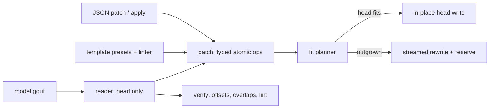

# gguf-chisel

[English](README.md) | [中文](README.zh.md) | [日本語](README.ja.md)

[](LICENSE) [](Cargo.toml)  [](CONTRIBUTING.md)

**Open-source surgical editor for GGUF metadata — patch keys, fix chat templates and reserve headroom in place, without rewriting tensor data.**


```bash
git clone https://github.com/JaydenCJ/gguf-chisel.git && cargo install --path gguf-chisel
```

> Pre-release: not on crates.io yet; the one-liner above builds a single static binary with zero dependencies.

## Why gguf-chisel?

A wrong `tokenizer.chat_template` or context-length key is the most common defect in published GGUF quants — and the smallest possible edit. Yet the standard fix today is llama.cpp's gguf-py scripts: a Python environment with numpy, and (for anything beyond overwriting an existing scalar) `gguf_new_metadata.py`, which copies the *entire* file — all 40 GB of a large quant — to change a few hundred bytes of head. gguf-chisel exploits the layout fact those scripts ignore: tensor offsets in GGUF are relative to the data section, so any edited head that still ends on the original data offset leaves every tensor byte untouched. It lands heads there byte-exactly with a managed pad key, refuses honestly when the head has truly outgrown its space, and even then only streams the tail verbatim — never re-encoding a tensor.

|  | gguf-chisel | gguf_set_metadata.py | gguf_new_metadata.py |
|---|---|---|---|
| Runtime | one static binary, zero deps | Python + gguf-py + numpy | Python + gguf-py + numpy |
| Change an existing scalar | in place, head-only write | in place | full-file rewrite |
| Add / remove / rename keys | in place while headroom lasts | no | full-file rewrite |
| Fix a chat template | in place or one streamed rewrite¹ | no | full-file rewrite |
| Template lint + presets | yes (`template check`, 6 presets) | no | no |
| Reserve headroom for future edits | yes (`--reserve`) | no | no |
| Structural verification | yes (`verify`) | no | no |
| Scriptable fit probe | yes (`--dry-run`, exit 0/3) | no | no |

<sub>¹ In place whenever the new head fits the existing space (shrinking or padded edits always do); growth beyond it takes one `--rewrite` that streams tensor bytes verbatim — pass `--reserve` once and later edits stay in place. Dependency counts checked against llama.cpp's gguf-py on 2026-07-13.</sub>

## Features

- **In-place by construction** — the fit planner lands every edited head exactly on the original data offset, combining alignment slack with a byte-exactly sized managed pad key; the tensor region is never even opened for writing.
- **Headroom you control** — `--reserve 4K` on a rewrite leaves spare pad bytes, so every future `set`/`rm`/`template set` is a pure head write; `show` reports the remaining headroom of any file.
- **Chat templates as a first-class fix** — `template show/set/check/presets` with six community-standard presets and a Jinja-subset linter that catches unbalanced delimiters, mismatched blocks and missing `messages` loops *before* anything is written.
- **Typed, atomic edits** — `KEY=VALUE` keeps the key's existing wire type, `KEY=u32:32768` forces one, range violations name their bounds, and multi-key operations apply all-or-nothing.
- **Scriptable end to end** — `dump` emits exact-integer JSON, `apply` runs delete/rename/set patch documents from a file or stdin, and `--dry-run` answers "will this fit?" via exit code (0 fits, 3 needs rewrite).
- **A verifier for publishers** — `verify` checks duplicate keys, alignment, tensor offsets, extents and overlaps against a built-in ggml type-size table, and lints the embedded template.
- **Zero dependencies, fully offline** — GGUF codec, JSON codec and linter are all std-only Rust; the tool never touches the network.

## Quickstart

Install (requires Rust 1.75+):

```bash
git clone https://github.com/JaydenCJ/gguf-chisel.git && cargo install --path gguf-chisel
```

Fix a context length in place — on a real model this writes a few KiB of head and leaves the other ~40 GB alone:

```bash
gguf-chisel set model.gguf sample.context_length=32768
```

Output (real capture, against `gguf-chisel sample model.gguf`):

```text
set sample.context_length: u32 4096 -> u32 32768
patched model.gguf in place: 704 head bytes written, tensor data untouched
```

Install a longer chat template: gguf-chisel refuses to guess, asks for one streamed rewrite, and `--reserve` makes it the last rewrite this file ever needs:

```text
$ gguf-chisel template set model.gguf --preset llama3
set tokenizer.chat_template: string "{{ '<|im_st…" (201 bytes) -> string "{{ bos_token }}{% for message in message…" (261 bytes)
gguf-chisel: metadata head grew beyond the available space (need 752 bytes, have 704); re-run with --rewrite (optionally -o NEW.gguf), and consider --reserve to leave headroom for future in-place edits

$ gguf-chisel template set model.gguf --preset llama3 --rewrite --reserve 4K
set tokenizer.chat_template: string "{{ '<|im_st…" (201 bytes) -> string "{{ bos_token }}{% for message in message…" (261 bytes)
rewrote model.gguf: 4878 head bytes (+4096 reserved), copied 160 bytes of tensor data

$ gguf-chisel set model.gguf "general.name=Sample 32k"
set general.name: string "gguf-chisel sample model" -> string "Sample 32k"
patched model.gguf in place: 4896 head bytes written, tensor data untouched

$ gguf-chisel verify model.gguf
model.gguf: OK
  gguf v3, 10 metadata keys, 2 tensors, data section 160 bytes
```

`examples/fix-metadata.sh` runs the whole workflow offline against a generated sample.

## Commands and write options

| Command | Effect |
|---|---|
| `show` / `get` / `dump` | Inspect: layout summary + headroom, one value (`--json`, `--raw`), or the full head as JSON |
| `set` / `rm` / `rename` | Patch keys: `KEY=VALUE` (keeps type) or `KEY=TYPE:VALUE`; atomic across multiple keys |
| `apply` | Run a JSON patch document (`delete` → `rename` → `set`), from file or stdin |
| `template show/set/check/presets` | Export, install (preset or file, lint-gated), lint, and list chat templates |
| `verify` | Structural checks; exit 1 on errors |
| `sample` | Deterministic ~1 KiB GGUF for pipeline tests |

| Flag | Default | Effect |
|---|---|---|
| `--dry-run` | off | Plan only; exit 0 if the edit fits in place, 3 if it needs a rewrite |
| `--rewrite` | off | Allow the streamed rewrite when the head has outgrown its space |
| `-o, --output FILE` | in place | Write the result to a new file, leaving the source untouched |
| `--reserve N` | 0 | On rewrite, keep N bytes of headroom (accepts `K`/`M`/`G`) |

Edits to `general.alignment` are refused in 0.1.0 (they would move every tensor), and array values are read-only. The mechanics of the fit planner and the managed `chisel.pad` key are documented in [docs/in-place-patching.md](docs/in-place-patching.md).

## Architecture



## Roadmap

- [x] Core toolkit: v2/v3 head codec, in-place fit planner with managed headroom, typed atomic edits, chat-template presets + linter, JSON dump/apply, structural verifier, sample generator
- [ ] Array value editing (tokenizer arrays, split-file key lists)
- [ ] Multi-part (`-00001-of-000NN`) shard awareness
- [ ] `template render` — dry-run a template against a sample chat to preview the prompt
- [ ] Editing `general.alignment` via planned tensor relocation
- [ ] Big-endian GGUF support

See the [open issues](https://github.com/JaydenCJ/gguf-chisel/issues) for the full list.

## Contributing

Contributions are welcome — see [CONTRIBUTING.md](CONTRIBUTING.md), start with a [good first issue](https://github.com/JaydenCJ/gguf-chisel/issues?q=is%3Aissue+is%3Aopen+label%3A%22good+first+issue%22) or open a [discussion](https://github.com/JaydenCJ/gguf-chisel/discussions).

## License

[MIT](LICENSE)
