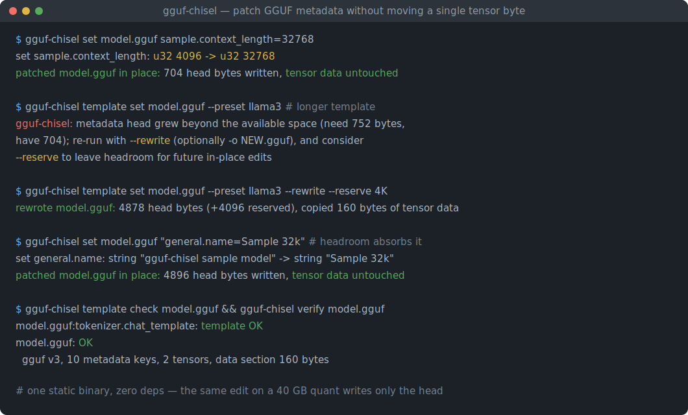
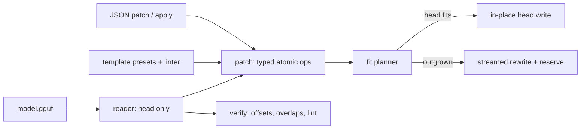

# gguf-chisel

[English](README.md) | [中文](README.zh.md) | [日本語](README.ja.md)

[](LICENSE) [](Cargo.toml)  [](CONTRIBUTING.md)

**开源的 GGUF 元数据外科手术式编辑器——原位修补键值、修复聊天模板、预留头部余量，全程不重写张量数据。**



```bash
git clone https://github.com/JaydenCJ/gguf-chisel.git && cargo install --path gguf-chisel
```

> 预发布版本：尚未上架 crates.io；上面这条命令会构建出一个零依赖的单一静态二进制。

## 为什么选择 gguf-chisel？

错误的 `tokenizer.chat_template` 或上下文长度键是已发布 GGUF 量化模型里最常见的缺陷——同时也是最小的一处修改。可如今的标准修法却是 llama.cpp 的 gguf-py 脚本：先装好带 numpy 的 Python 环境，而且只要超出"覆写既有标量"的范围，就得用 `gguf_new_metadata.py` 把*整个*文件复制一遍——大型量化模型足足 40 GB，只为改动头部里几百个字节。gguf-chisel 利用了这些脚本忽略的布局事实：GGUF 中张量偏移量是相对数据段起点的，因此只要编辑后的头部仍然结束在原来的数据偏移处，所有张量字节就分毫不动。它借助一个受管的填充键把头部逐字节精确地落在那个位置；当头部确实装不下时会诚实拒绝，即便那时也只是把尾部原样流式复制——绝不重新编码任何张量。

|  | gguf-chisel | gguf_set_metadata.py | gguf_new_metadata.py |
|---|---|---|---|
| 运行环境 | 单一静态二进制，零依赖 | Python + gguf-py + numpy | Python + gguf-py + numpy |
| 修改既有标量 | 原位，仅写头部 | 原位 | 整文件重写 |
| 增删改键名 | 余量允许时原位完成 | 不支持 | 整文件重写 |
| 修复聊天模板 | 原位，或一次流式重写¹ | 不支持 | 整文件重写 |
| 模板 lint + 预设 | 有（`template check`，6 个预设） | 无 | 无 |
| 为后续编辑预留余量 | 有（`--reserve`） | 无 | 无 |
| 结构校验 | 有（`verify`） | 无 | 无 |
| 可脚本化的适配探测 | 有（`--dry-run`，退出码 0/3） | 无 | 无 |

<sub>¹ 只要新头部装得进现有空间就原位完成（缩小或可填充的编辑总是可以）；超出空间时需一次 `--rewrite`，张量字节原样流过——加一次 `--reserve`，之后的编辑就都留在原位。依赖数量于 2026-07-13 对照 llama.cpp 的 gguf-py 核实。</sub>

## 功能特性

- **从构造上保证原位** —— 适配规划器把每个编辑后的头部精确落在原数据偏移处，综合利用对齐空隙与逐字节调长的受管填充键；张量区域甚至从不以写模式打开。
- **余量由你掌控** —— 重写时加 `--reserve 4K` 留出备用填充字节，之后的每次 `set`/`rm`/`template set` 都是纯头部写入；`show` 能报告任意文件剩余的余量。
- **聊天模板是一等公民** —— `template show/set/check/presets` 带六个社区标准预设，以及一个 Jinja 子集 linter，在写入*之前*就能揪出括号失衡、块不匹配和缺失的 `messages` 循环。
- **类型化的原子编辑** —— `KEY=VALUE` 保持键的既有线上类型，`KEY=u32:32768` 强制指定，越界会报出具体边界，多键操作要么全部生效要么全不生效。
- **端到端可脚本化** —— `dump` 输出整数精确的 JSON，`apply` 从文件或 stdin 执行 delete/rename/set 补丁文档，`--dry-run` 用退出码回答"装得下吗？"（0 装得下，3 需要重写）。
- **给发布者的校验器** —— `verify` 依据内置的 ggml 类型尺寸表检查重复键、对齐、张量偏移、范围与重叠，并对内嵌模板做 lint。
- **零依赖、完全离线** —— GGUF 编解码、JSON 编解码和 linter 全部是纯 std 的 Rust；工具从不触碰网络。

## 快速上手

安装（需要 Rust 1.75+）：

```bash
git clone https://github.com/JaydenCJ/gguf-chisel.git && cargo install --path gguf-chisel
```

原位修复一个上下文长度——在真实模型上这只写入几 KiB 的头部，其余约 40 GB 原封不动：

```bash
gguf-chisel set model.gguf sample.context_length=32768
```

输出（真实捕获，针对 `gguf-chisel sample model.gguf`）：

```text
set sample.context_length: u32 4096 -> u32 32768
patched model.gguf in place: 704 head bytes written, tensor data untouched
```

安装一个更长的聊天模板：gguf-chisel 不会瞎猜，而是要求一次流式重写，配合 `--reserve`，这将是该文件此生最后一次重写：

```text
$ gguf-chisel template set model.gguf --preset llama3
set tokenizer.chat_template: string "{{ '<|im_st…" (201 bytes) -> string "{{ bos_token }}{% for message in message…" (261 bytes)
gguf-chisel: metadata head grew beyond the available space (need 752 bytes, have 704); re-run with --rewrite (optionally -o NEW.gguf), and consider --reserve to leave headroom for future in-place edits

$ gguf-chisel template set model.gguf --preset llama3 --rewrite --reserve 4K
set tokenizer.chat_template: string "{{ '<|im_st…" (201 bytes) -> string "{{ bos_token }}{% for message in message…" (261 bytes)
rewrote model.gguf: 4878 head bytes (+4096 reserved), copied 160 bytes of tensor data

$ gguf-chisel set model.gguf "general.name=Sample 32k"
set general.name: string "gguf-chisel sample model" -> string "Sample 32k"
patched model.gguf in place: 4896 head bytes written, tensor data untouched

$ gguf-chisel verify model.gguf
model.gguf: OK
  gguf v3, 10 metadata keys, 2 tensors, data section 160 bytes
```

`examples/fix-metadata.sh` 会针对生成的样例离线跑完整个工作流。

## 命令与写入选项

| 命令 | 作用 |
|---|---|
| `show` / `get` / `dump` | 查看：布局摘要 + 余量、单个值（`--json`、`--raw`）、或整个头部的 JSON |
| `set` / `rm` / `rename` | 修补键值：`KEY=VALUE`（保持类型）或 `KEY=TYPE:VALUE`；多键原子生效 |
| `apply` | 执行 JSON 补丁文档（`delete` → `rename` → `set`），来自文件或 stdin |
| `template show/set/check/presets` | 导出、安装（预设或文件，须过 lint）、检查以及列出聊天模板 |
| `verify` | 结构检查；有错误时退出码 1 |
| `sample` | 确定性的约 1 KiB GGUF，供流水线测试用 |

| 选项 | 默认 | 作用 |
|---|---|---|
| `--dry-run` | 关 | 只做规划；装得下原位则退出 0，需要重写则退出 3 |
| `--rewrite` | 关 | 头部装不下时允许流式重写 |
| `-o, --output FILE` | 原位 | 结果写入新文件，源文件保持不动 |
| `--reserve N` | 0 | 重写时预留 N 字节余量（支持 `K`/`M`/`G`） |

0.1.0 中拒绝编辑 `general.alignment`（那会移动所有张量），数组值为只读。适配规划器与受管 `chisel.pad` 键的机制详见 [docs/in-place-patching.md](docs/in-place-patching.md)。

## 架构



## 路线图

- [x] 核心工具集：v2/v3 头部编解码、带受管余量的原位适配规划器、类型化原子编辑、聊天模板预设 + linter、JSON dump/apply、结构校验器、样例生成器
- [ ] 数组值编辑（tokenizer 数组、分片文件键列表）
- [ ] 多分片（`-00001-of-000NN`）文件感知
- [ ] `template render`——用一段样例对话试渲染模板，预览最终 prompt
- [ ] 通过规划好的张量搬移支持编辑 `general.alignment`
- [ ] 大端序 GGUF 支持

完整列表见 [open issues](https://github.com/JaydenCJ/gguf-chisel/issues)。

## 参与贡献

欢迎贡献——请阅读 [CONTRIBUTING.md](CONTRIBUTING.md)，可以从 [good first issue](https://github.com/JaydenCJ/gguf-chisel/issues?q=is%3Aissue+is%3Aopen+label%3A%22good+first+issue%22) 入手，或发起一个 [discussion](https://github.com/JaydenCJ/gguf-chisel/discussions)。

## 许可证

[MIT](LICENSE)
